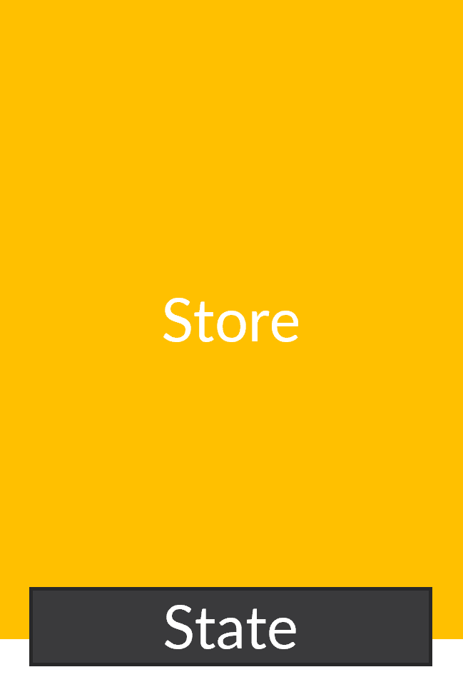
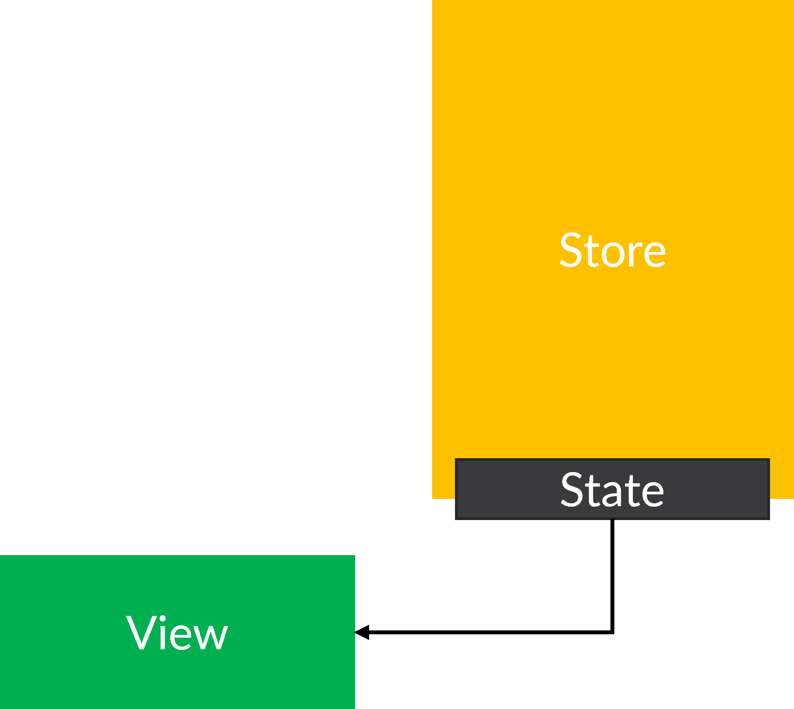
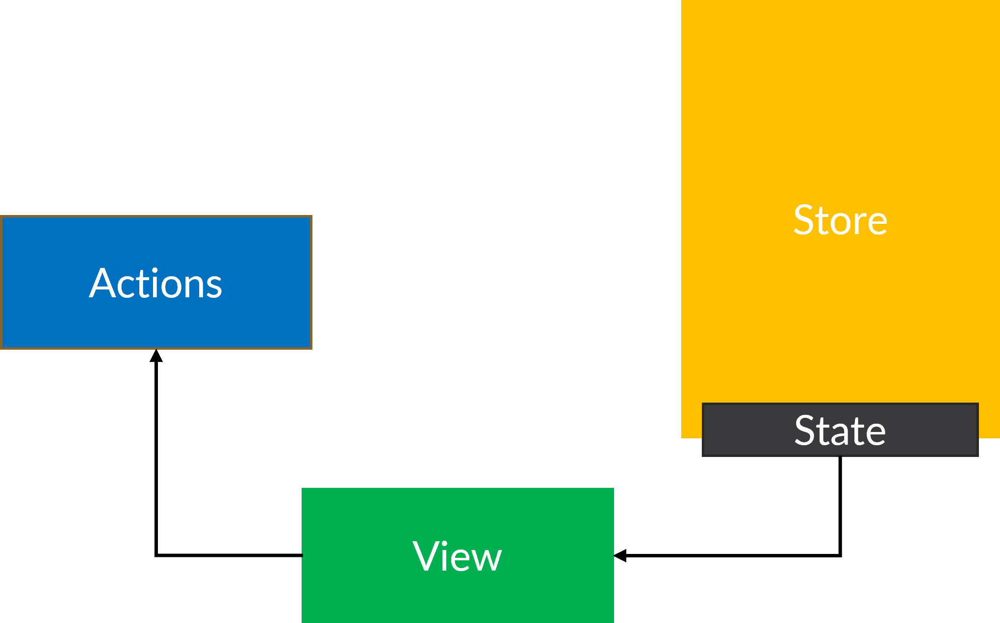
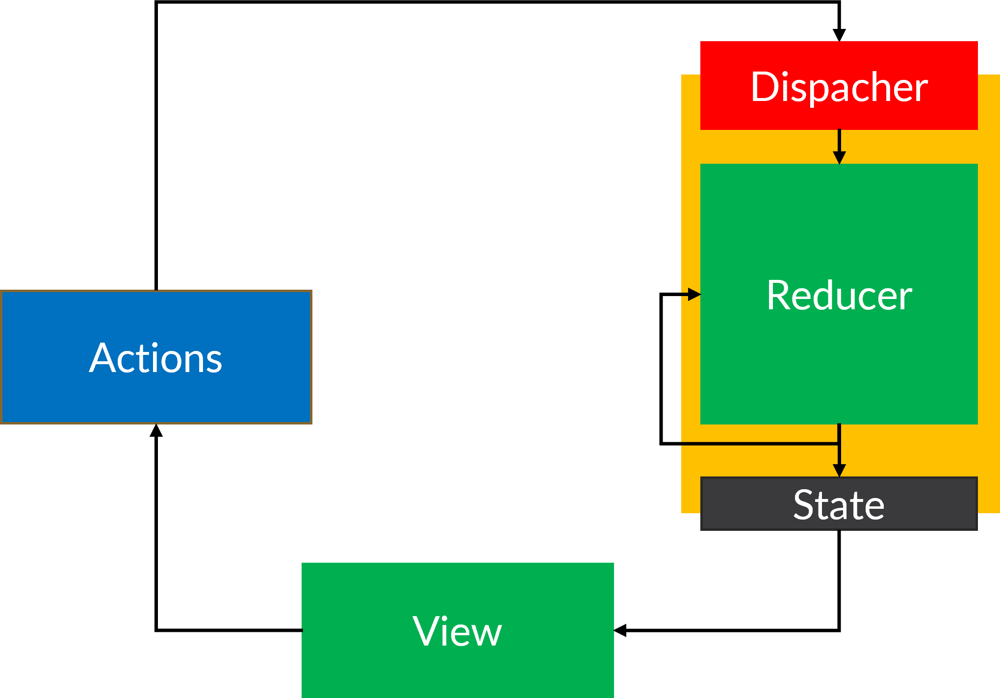

# Le design pattern redux

- [Le design pattern redux](#le-design-pattern-redux)
- [Le store](#le-store)
- [Query](#query)
- [Actions](#actions)
  - [Exemple d'actions](#exemple-dactions)
- [Reducer](#reducer)
  - [Pure function](#pure-function)

Redux est le design pattern qui permet de gérer les données d'une application.
C'est le desgin pattern dominant dans le monde du dévelopement web frontend.

1. Une Source de vérité
2. Un State Read-only 
3. Changements effectués par les reducers.

# Le store

* Class d’accès au données 
* On utilise le store pour récupérer les données dans les vues



```ts
import { ProductState } from "./product.state";
import { ComponentStore } from '@ngrx/component-store';

@Injectable()
export class ProductStore extends ComponentStore<ProductState> {

    constructor() {
        super(new ProductState());
    }

………
}
```

# Query 



`Product.selector.ts`
```ts
import { createFeatureSelector, createSelector } from "@ngrx/store";
import { Product } from "../models/Product.model";
import { ProductState } from "./product.state";

export const getProductState = createFeatureSelector<ProductState>('product');

export const getProducts$ = createSelector(getProductState, (state: ProductState) => state.products);

export const getProduct$ = (productId: number) => createSelector(getProducts$, (products : Product[]) => products.filter(s => s.id == productId))

```

`Products.component.ts`
```ts
import { Component, OnInit } from '@angular/core';
import { Observable } from 'rxjs';
import { Product } from 'src/app/models/Product.model';
import { getProducts$ } from 'src/app/store/product.selector';
import { ProductStore } from 'src/app/store/product.store';
@Component({
 …
})
export class ProductListComponent implements OnInit {
    products$?: Observable<Product[]>;
    constructor(private productStore: Store<ProductStore>) { }
    
    ngOnInit(): void {
        this.products$ = this.productStore.select(getProducts$);   
    }
}
```

`Product.component.html`
```html
<p-listbox [options]="products$ | async" optionLabel="name"></p-listbox>
```


# Actions




`Product.action.ts`
```ts
import { createAction, props } from '@ngrx/store';
import { Product } from '../models/Product.model';

export const addProduct = createAction(
    '[Product list] Add Product',
    props<{ product: Product }>() // Paramètre de l'action
);
```


## Exemple d'actions 
* Connexion d'un utilisateur après l'appui sur le bouton.
* Afficher un menu
* Réccupération de données
* Affichage d'un spinner lors de la récupération de données


# Reducer

Le Reducer va gérer les actions demandé de manière synchrone.
Les reducers doivent être des Pure Functions (cf si dessous)



`Product.reducer.ts`
```ts
import { createReducer, on } from "@ngrx/store";
import { addProduct } from "./product.actions";
import { initialProductState, ProductState } from "./product.state";
const reducer = createReducer(
    initialProductState,
    on(addProduct, (state: ProductState, { product }) => ({...state, loading: true, 	products: state.products.concat(product)}))
    // ....
);
export function productReducer(state: ProductState | undefined, action: any) {
    return reducer(state, action);
}
```

## Pure function
Une pure function est une fonction qui ne va pas dépendre de paramètre extèrieur dans son traitement.

Peu importe l'état de l'application le résultat sera toujours le même.

On va donc pouvoir facillemnt débuger le state.

Exemple : 
`Pure function`
```ts 
function add (a: number, b: number){
    return a + b;
}

add(1, 3); // 4
add(8, 3); // 11
```

`Non pure function`
```ts
let c = 4;

function add (a: number, b: number){
    return a + b + c; // 'c' est une variable globale, la fonction n'est donc pas pure.
}

add(1, 3); // 7
c = 5;
add(1, 3); // 8 
```