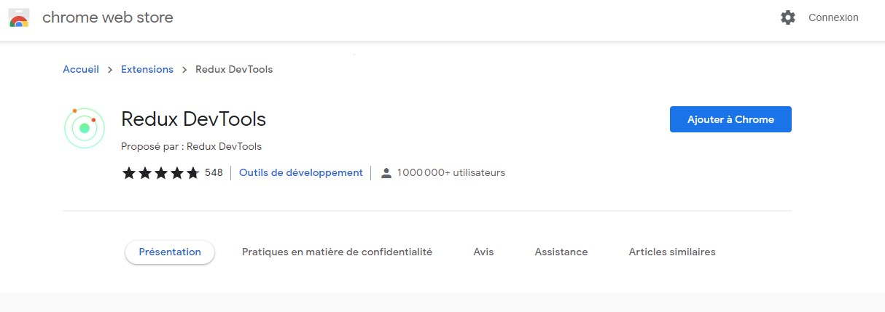

# Redux DevTools

## Extensions Chrome
Une extension est disponible pour les navigateurs Chronium. 
* Google Chrome
* Brave Browser
* Edge Chromium
* ...

Il semble que Firefox ait aussi une extension. 

A l'addresse suivante : https://chrome.google.com/webstore/detail/redux-devtools/lmhkpmbekcpmknklioeibfkpmmfibljd

## NgRx devtools

https://ngrx.io/guide/store-devtools/install

