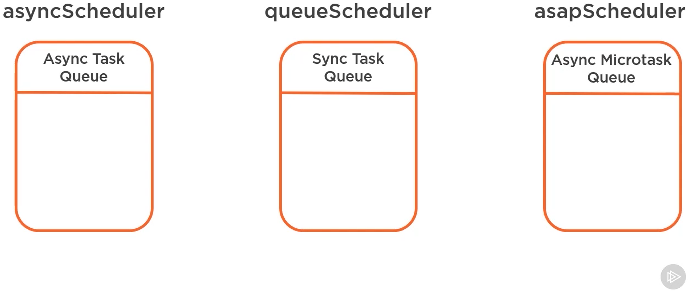

# Schedulers

Il vont permetre de gérer quand est ce que le code s'exécute.

1. Queue-based schedulers
2. asapScheduler
3. asyncScheduler

* animationFrameScheduler

Le QueueScheduler vas s'exécuter de manière synchrone.
S'il n'y a rien dans la queue de l'event loop, il va aller chercher dans l'async micro-task loop.
Enfin il va aller regarder dans l'AsyncQueue.

On va mettre dans l'async queue des tâches qui sont plus lourde. On ne veut pas qu'elles bloquent l'event loop principal qui donnerait l'impression que l'application ne réagie plus. 